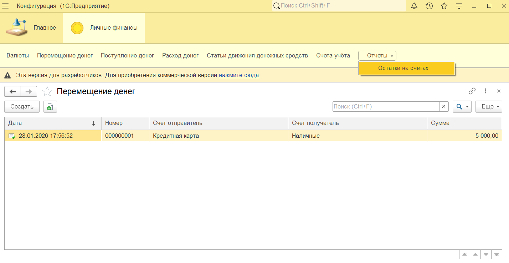
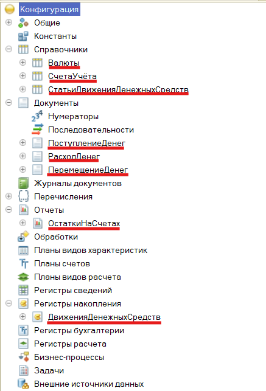
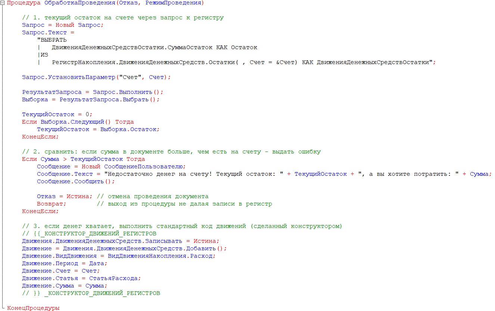
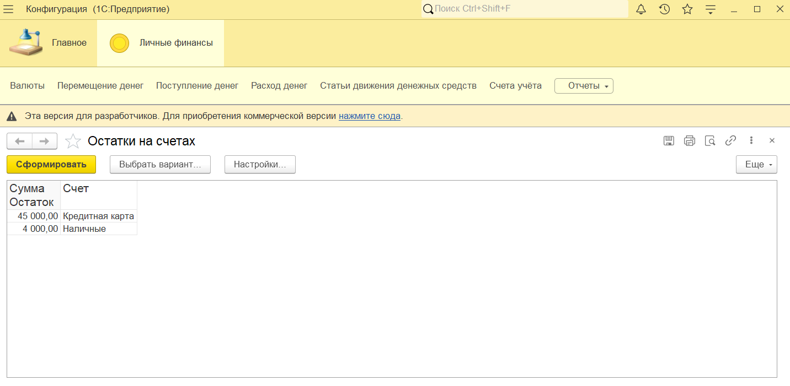

# 💰 Приложение "Личные финансы"

Учебный pet-проект на платформе **1С:Предприятие 8.3**

Приложение позволяет вести учет денежных средств на различных счетах, фиксировать доходы, расходы и перемещения между кошельками.

## 🔑 Ключевые возможности

- **Учет в разрезе счетов и статей:** детальная классификация операций.
    
- **Контроль отрицательных остатков:** программная проверка в модулях документов, предотвращающая списание средств.
    
- **Движения по регистрам:** оперативное получение остатков и оборотов.
    
- **Аналитическая отчетность:** гибкие отчеты на базе **СКД**.
    

## 🧰 Технологический стек

- **Платформа:** 1С:Предприятие 8.3 (учебная версия)
    
- **Механизмы:** Справочники, Документы, Регистры накопления, Запросы, СКД
    
- **Язык:** Встроенный язык 1С "@ -Encoding UTF8

## 📸 Скриншоты системы

### Главный экран

### Структура конфигурации

### Код документа

### Отчет по остаткам

